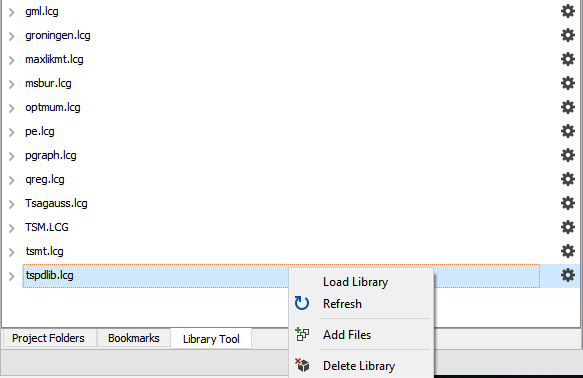

# gxgboost
Lightweight GAUSS wrapper for the popular XGBoost library.

> XGBoost is an optimized distributed gradient boosting library designed to be highly ***efficient***, ***flexible*** and ***portable***.
> It implements machine learning algorithms under the [Gradient Boosting](https://en.wikipedia.org/wiki/Gradient_boosting) framework.

## Installation

```bash
$ git clone --recursive https://github.com/aptech/gxgboost
$ cd gxgboost
$ mkdir build
$ cd build
```

### GAUSS Package manager
The GAUSS **gxgboost** library can be installed and updated directly in GAUSS using the [GAUSS package manager](https://www.aptech.com/blog/gauss-package-manager-basics/).

### Windows
```bash
$ cmake -G"NMake Makefiles" -DCMAKE_BUILD_TYPE=Release ..
$ nmake install OR jom install
```

### Linux / macOS
```bash
$ cmake -G"Unix Makefiles" -DCMAKE_BUILD_TYPE=Release ..
$ make -jN install
```

### GAUSS application installer
The [*gxgboost.zip* release folder](https://github.com/aptech/gxgboost/releases) can be easily installed using the [**GAUSS Application Installer**](https://www.aptech.com/support/installation/using-the-applications-installer-wizard/), as shown below:
1. Download the zipped folder `gxgboost.zip` from the [gxgoost release page](https://github.com/aptech/gxgboost/releases).
2. Select **Tools > Install Application** from the main **GAUSS** menu.
  
3. Follow the installer prompts, making sure to navigate to the downloaded `gxgboost.zip`.
4. Before using the functions created by `gxgboost` you will need to load the newly created `gxgboost` library. This can be done in a number of ways:
  *   Navigate to the library tool view window and click the small wrench located next to the `gxgboost` library. Select `Load Library`.  
  
  *  Enter `library gxgboost` in the program input/output window.
  *  Put the line `library gxgboost;` at the beginning of your program files.

### GAUSS package installer CLI
In addition, you can also use the GAUSS package installer CLI (*gpkg(.exe)*) in the GAUSS installation directory:
  - `gpkg install gxgboost.zip`

## Requirements
OpenMP must be installed on the target system to successfully compile or use the **gxgboost** library.

### Windows
Install the [Visual C++ Redistributable for Visual Studio 2015](https://www.microsoft.com/en-ca/download/details.aspx?id=48145) if it is not already installed.

### Linux
Built against GCC OpenMP (libgomp1)
```bash
# Ubuntu
$ sudo apt install libgomp1

# RHEL/CentOS
$ sudo yum install libgomp
```

### macOS
LLVM's OpenMP runtime library:
```bash
# Homebrew
$ brew install libomp
```

## Usage
Refer to <data/gxgboost.e> for a full example and data/gxgboost.sdf for full description of parameters.

### Setup
Initialize a control structure for the boosting method of your choice.

### Train

The following code samples are all verbose to showcase utilizing their associated control structures.
Providing a control structure is not necessary if you wish to use the default values. These can all be referenced in <data/gxgboost.sdf>

#### Tree Booster
```
library gxgboost;

/*
** Declare instance of the
** xgbTree control structure
*/
struct xgbTree ctl;

/*
** Initialize control structure with
** default values
*/
ctl = xgbCreateCtl("tree");

// Declare instance of xgbModel structure
struct xgbModel model;

// Call xgbTreeFit
model = xgbTreeFit(labels, train_data, ctl);
```

#### Dart Boooster
```
library gxgboost;

/*
** Declare instance of the
** xgbDart control structure
*/
struct xgbDart ctl;

/*
** Initialize control structure with
** default values
*/
ctl = xgbCreateCtl("dart");

// Declare instance of xgbModel structure
struct xgbModel model;

// Call xgbDartFit
model = xgbDartFit(labels, train_data, ctl);
```

#### Linear Booster
```
library gxgboost;

/*
** Declare instance of the
** xgbLinear control structure
*/
struct xgbLinear ctl;

/*
** Initialize control structure with
** default values
*/
ctl = xgbCreateCtl("linear");

// Declare instance of xgbModel structure
struct xgbModel model;

// Call xgbLinearFit
model = xgbLinearFit(labels, train_data, ctl);
```

### Predict
```
pred = xgbPredict(model, test_data);
```

## License
-------
© Contributors, 2018. Licensed under an [Apache-2](https://github.com/dmlc/xgboost/blob/master/LICENSE) license.
